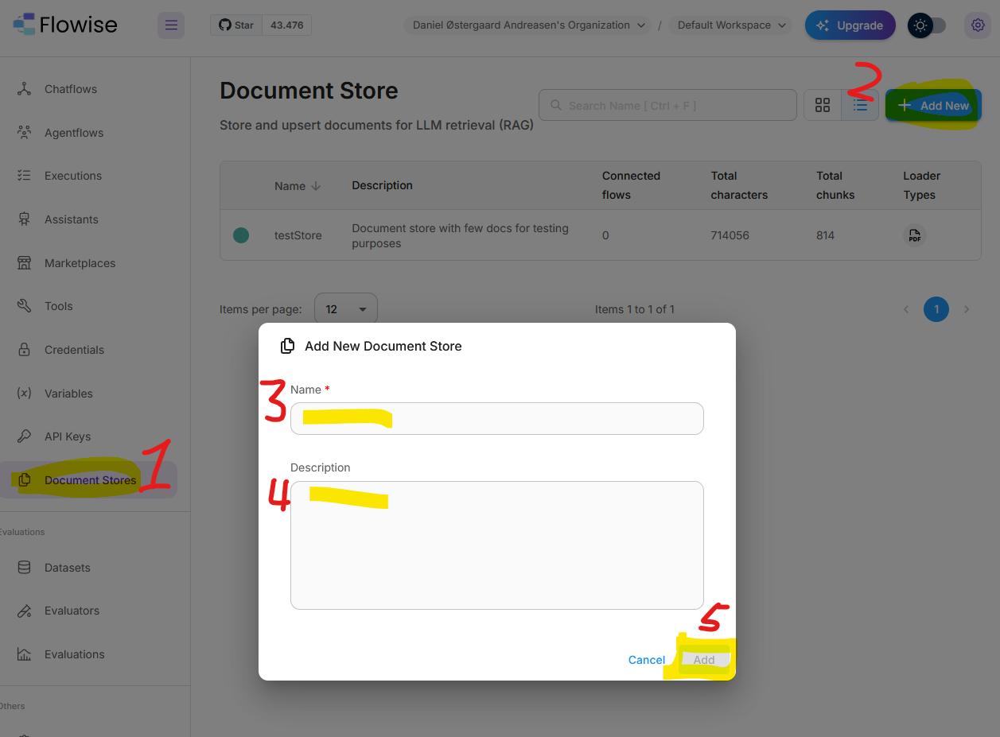
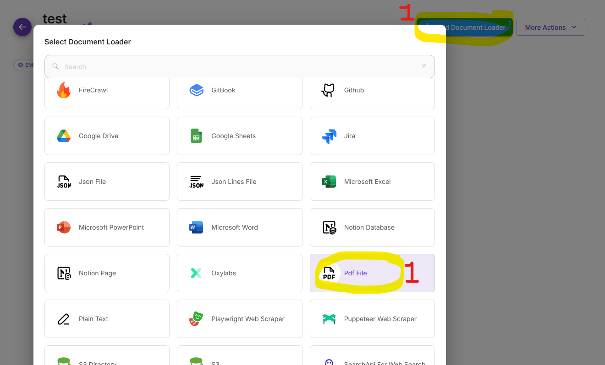
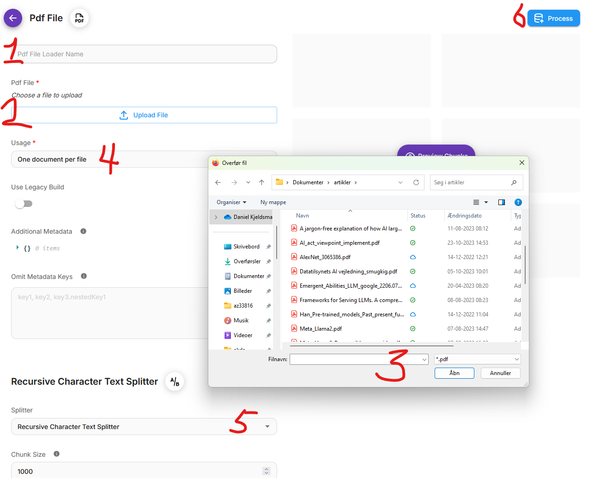
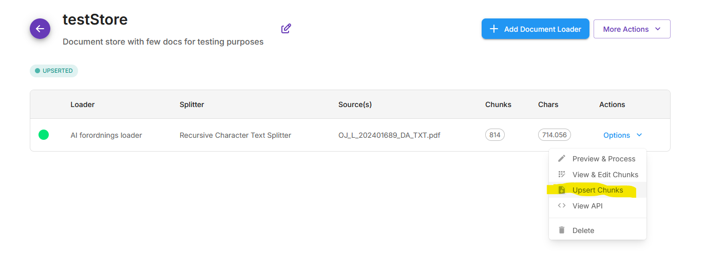
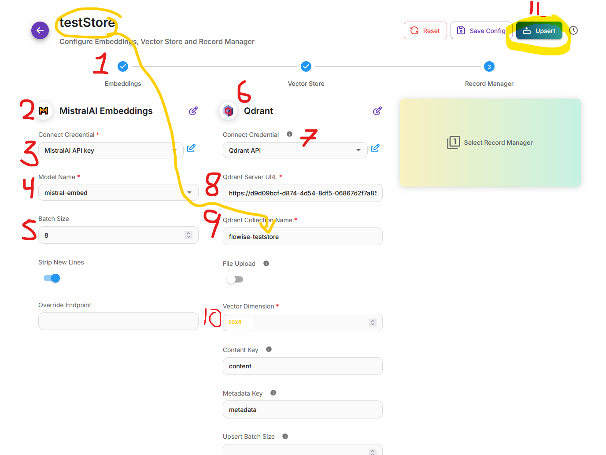

# Guide: Opsætning af Document Store

*Hvis du vil bygge en dokumentassistent/søge i en dokumentsamling/bygge RAG, får du brug for Document Store. Her er et simpelt eksempel på hvordan sådan en kan oprettes*

## Del 1: Opret Document Store

1. For at oprette en Document Store, skal du først tilføje en ny node ved at klikke på "+ Add Node" og vælge "Document Store"

   

2. Tilføj en Document Loader node, som skal bruges til at indlæse dokumenter i din Document Store

   

3. Konfigurer PDF-behandling ved at forbinde de relevante nodes og indstillinger

   

## Del 2: Konfigurer Document Store Actions

1. Tilføj ekstra actions for at kunne upserte dokumenter i din Document Store

   

2. Konfigurer upsert-funktionaliteten for at gemme og opdatere dokumenter

   
