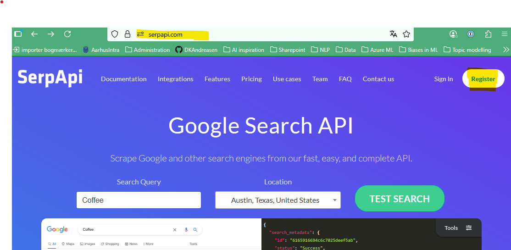
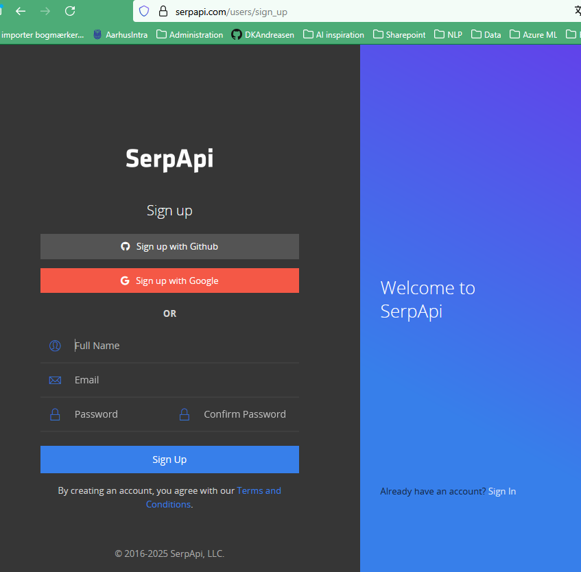
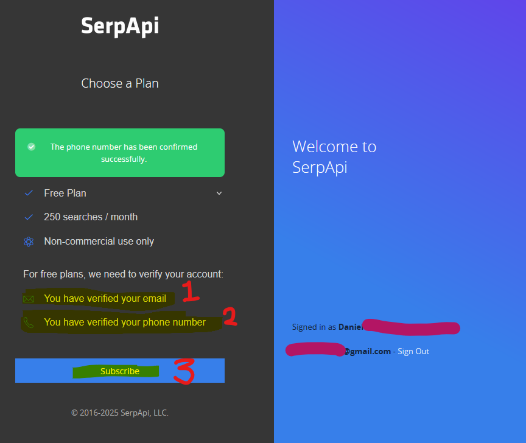
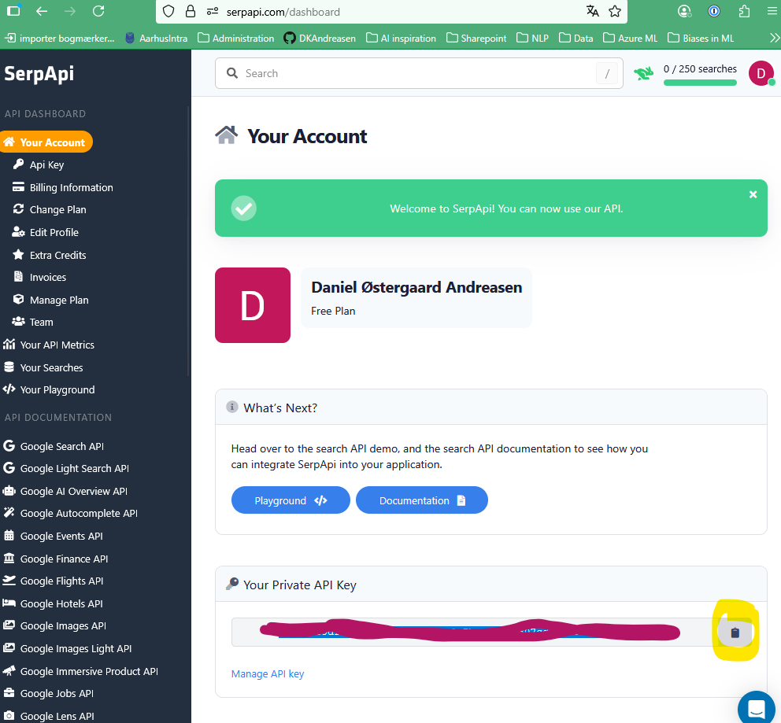
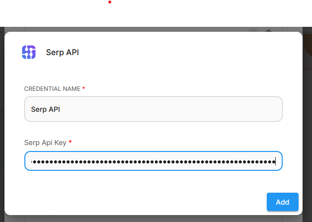

# Guide: Opsætning af SerpAPI

**Du får brug for SerpAPI til den del af workshoppen, hvor vi bygger en søgeassistent.**

## Del 1: Opret SerpAPI konto

1. Gå til [SerpAPI's hjemmeside](https://serpapi.com)  og klik på "Register" linket 

   

2. Forbind din google account eller udfyld formularen med dine oplysninger - husk at bruge private oplysninger, medmindre din kommune eksplicit har tilladt dig at bruge dine arbejdsoplysninger

   

3. Verificer med email og telefon

   

4. Efter oprettelsen lander du på dit dashboard, hvor du kan se og kopiere din API-nøgle

   

## Del 2: Tilføj SerpAPI nøgle til Flowise

1. Gå til [Flowise dashboard'et](https://cloud.flowiseai.com) og find credentials sektionen. Vælg "+ Add Credential" og find "SerpAPI" blandt mulighederne i pop-up'en

   
