# Guide: Opsætning af Flowise AI og Mistral API

## Del 1: Opret Flowise AI konto

1. Gå til [Flowise AI's hjemmeside](https://flowiseai.com) og vælg "Get started"

   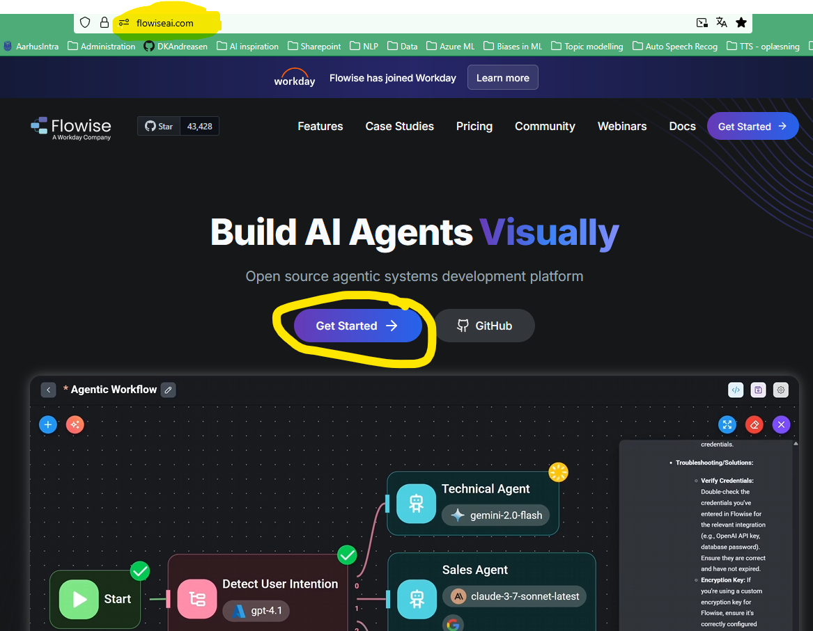

2. Klik på ["Sign up for free"](https://cloud.flowiseai.com/register) linket

   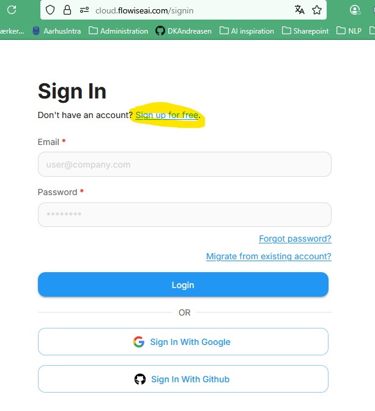

3. Vælg evt. "Sign In With Google", hvis du har en privat google konto, som du ikke har noget imod at knytte til flowiseai (bekvemmeligt) ellers udfylder du bare - husk at brug private oplysnigner, medmindre din kommune eksplicit har tilladt dig at bruge dine arbejdsoplysninger

   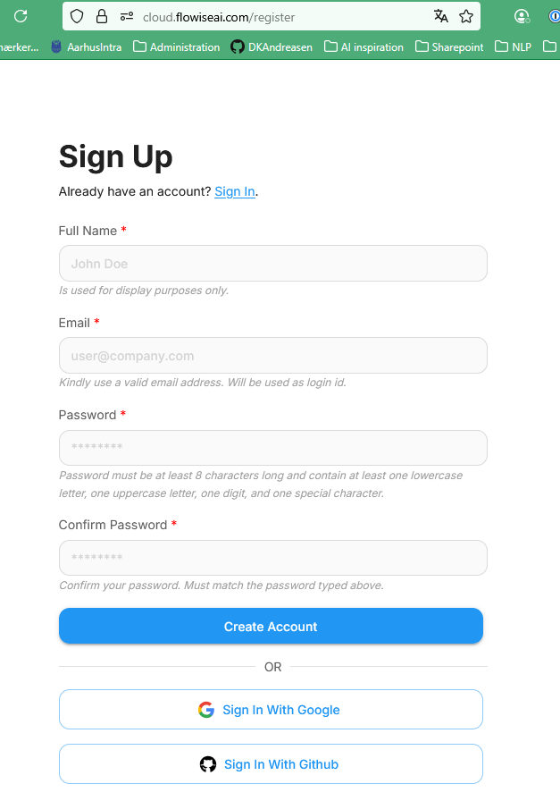

4. Efter successful oprettelse lander på dashboard'et, hvor du har mulighed for at slå dig løs. For rigtig at få valuta for dine data, skal vi dog lige have tilknyttet en sprogmodel.

   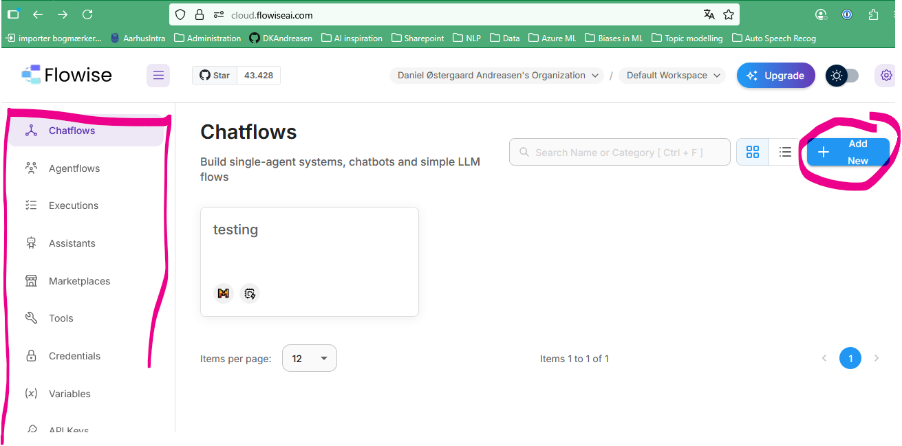

## Del 2: Opret Mistral AI konto og generer API nøgle

1. Åben en ny browser fane eller et nyt browser-vindue

1. Besøg [Mistral AI's hjemmeside](https://mistral.ai) og vælg ["Try the API"](https://console.mistral.ai/)

   

2. Vælg evt. google logoet, hvis du har en privat google konto, som du ikke har noget imod at knytte til mistral.ai (bekvemmeligt). Det samme gælder for Appel eller Microsoft, og ellers udfylder du bare - husk at brug private oplysnigner, medmindre din kommune eksplicit har tilladt dig at bruge dine arbejdsoplysninger.

   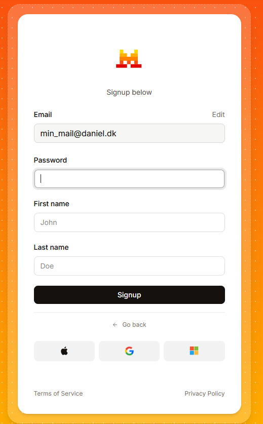

3. Lav et organisations navn og accepter betingelserne (dvs. sælg din sjæl)

   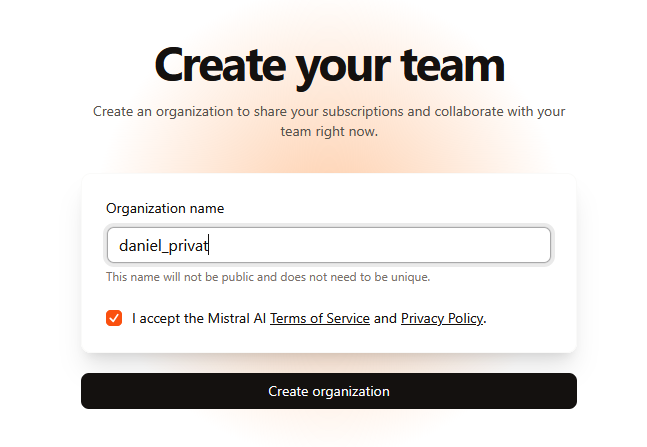

4. Du vil nu se Mistral's dashboard. Her vælger du "API Keys"

   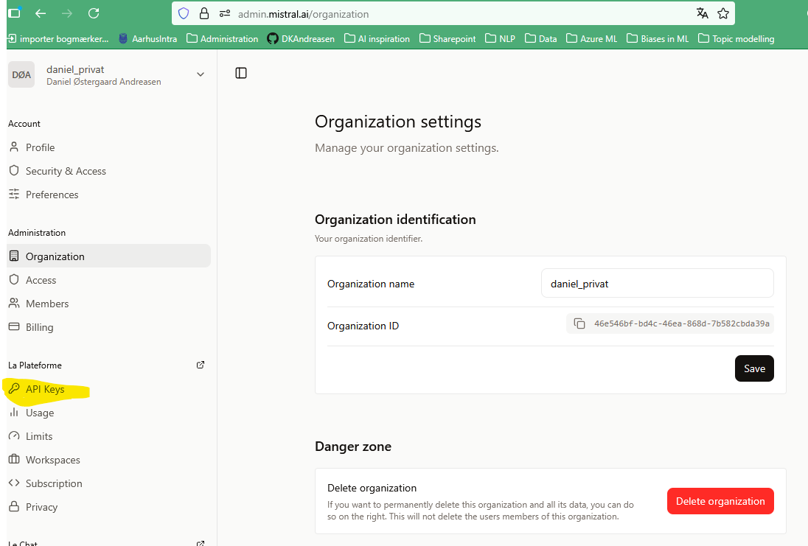

5. Vælg "Choose a plan"

   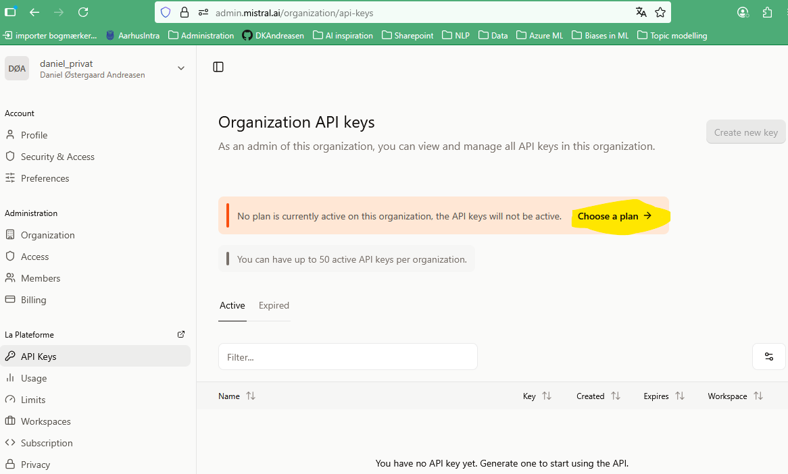

6. Vælg nu "Experiment for free", det kræver at du igen accepterer deres betingelser (primært at de må træne på det du foretager dig - _og det må de godt for **du LAVER PÅ INGEN MÅDE NOGET i denne workshop der har med forretningshemmeligheder, borger- eller medarbejder data at gøre**_)

   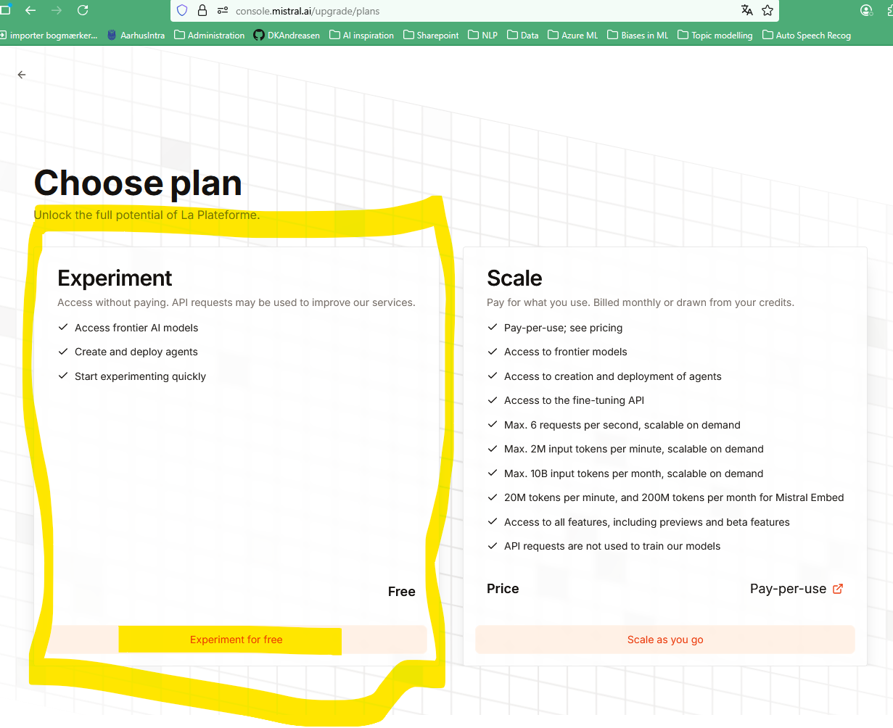

7. Fra dashboardet:

   1. Klik "API Keys"
   2. Klik "Create new key"
   3. skriv et "Key name" (og sæt evt. en udløbsdato)
   4. Klik "Create new key"

   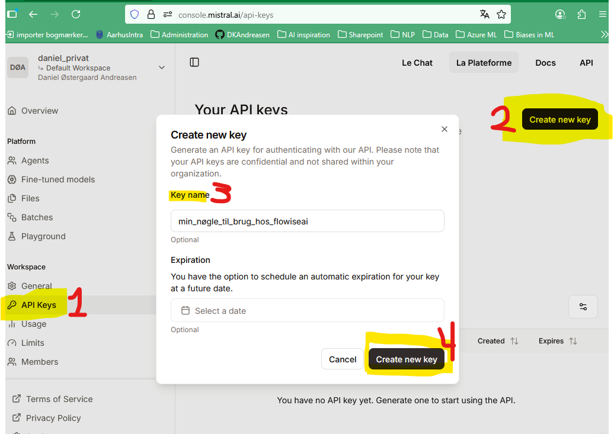

8. **VIGTIGT**: Gem din API nøgle et sikkert sted - den vises kun én gang!

   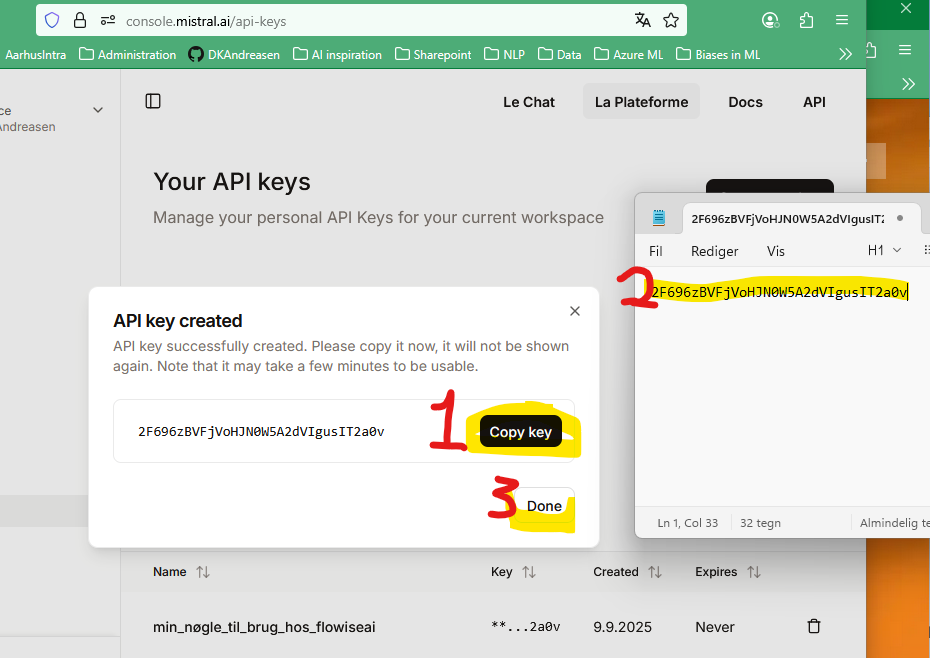
   
   _her er den gemt i midlertidigt i ren tekst i notesblok. Det er ikke den optimale løsning, men til denne workshop går det. Hvis du har en "Credential manager", så brug den i stedet._

## Del 3: Tilføj Mistral API nøgle til Flowise

1. Gå tilbage til [Flowise dashboard'et](cloud.flowiseai.com) (fanen eller vinduet fra før) og find credentials sektionen. Vælg "+ Add Credential" og find "MistralAI API" blandt alle mulighederne i pop-up'en (det kan være en fordel at søge efter "Mistral")

   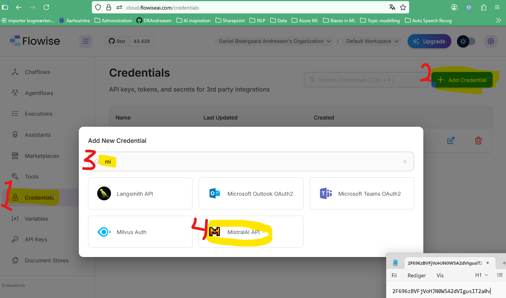

2. Indtast din Mistral API nøgle i den relevante sektion

   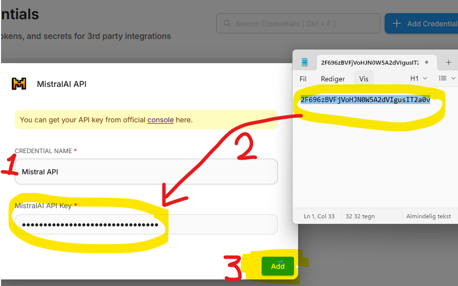

### Vigtige bemærkninger:
- Gem alle dine login oplysninger sikkert
- API nøglen kan kun ses én gang - sørg for at gemme den med det samme
- Hvis du mister din API nøgle, skal du generere en ny
- Brug en sikker internetforbindelse når du opretter konti og håndterer API nøgler

Nu er du klar til at bygge din første AI agent i workshoppen! 🎉

_Hvis du oplever problemer med opsætningen, så spørg din sidemakker til netværksmødet._